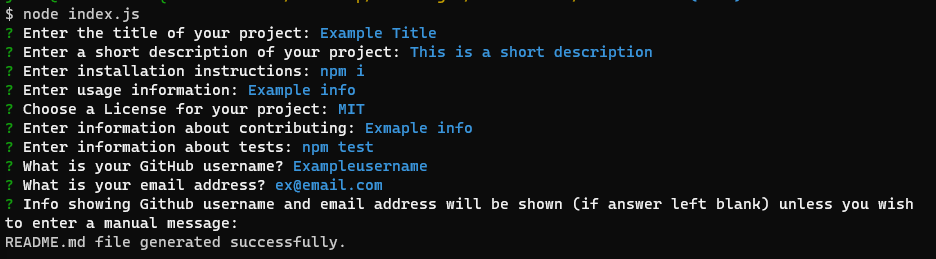

# README command-line generator

## Description

A README generator to quickly create a professional README for a new project in the terminal.

Walkthrough video: 
https://drive.google.com/file/d/1pqWIxnrhjIPCSIvh4ohDY3b66nvNdP9b/view

## Usage

For best experience use external terminal

## Steps

* 1 Assuming node in installed on your computer, open the terminal from root of `Node-ReadMe` Repo
* 2 Run the command `npm i` to install packages required (e.g. inquirer, fs)
* 3 Run the command `node index.js`
* 4 Answer prompts generated in terminal: 

       -  Title: Enter text 
       -  Short description: Enter text
       -  Installation instructions: Will provide default `npm i`, press enter to accept, or overwrite manually
       -  Usage information: Enter text
       -  License: Select from dropdown (this will generate a badge)
       -  Contributing information: Enter text
       -  Test information: Will provide default `npm test`, press enter to accept, or overwrite manually
       -  Github username: Enter text for username
       -  Email address: Enter text for email address
       -  Info for questions: If the above two (Github username and Email address) are entered, these will display under a "Questions" title if your answer is left blank, otherwise enter text to create a message that will overwrite this.

## Criteria

* A command-line application that accepts user input.
* When a user is prompted for information about the application repository then a high-quality, professional README.md is generated with:
    * The title of a project 
    * Sections entitled:
      * Description 
      * Table of Contents 
      * Installation 
      * Usage 
      * License 
      * Contributing 
      * Tests 
      * Questions
* When a user enters the project title then it is displayed as the title of the README
* When a user enters a description, installation instructions, usage information, contribution guidelines, and test instructions then this information is added to the sections of the README entitled Description, Installation, Usage, Contributing, and Tests
* When a user chooses a license for their application from a list of options then a badge for that license is added near the top of the README and a notice is added to the section of the README entitled **License** that explains which license the application is covered under
* When a user enters their GitHub username then this is added to the section of the README entitled Questions, with a link to their GitHub profile
* When a user enters their email address then this is added to the section of the README entitled Questions, with instructions on how to reach them with additional questions
* When a user clicks on the links in the **Table of Contents** then they are taken to the corresponding section of the README

## Technologies/Languages

* Node.js
* npm
* JavaScript
* [Inquirer package](https://www.npmjs.com/package/inquirer).

